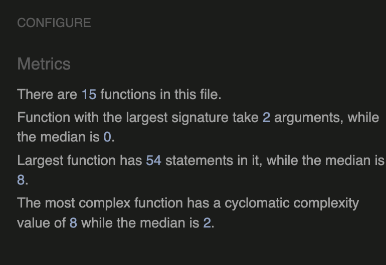

# Testing
 Click to return back to [README.md](README.md)

## Code Validation

### Javascript JSHint 
All JavaScript code was analysed with [JSHint](https://jshint.com)

** Some JS files may appear to contain undefined variables. This is because those are created by Django in different templates when views are rendered. ** 

| File | Screenshot |
|---|---|
|admin.js||
|book.js||
|edit.js||
|filter.js||
|new_cruise.js||
|new_destination.js||