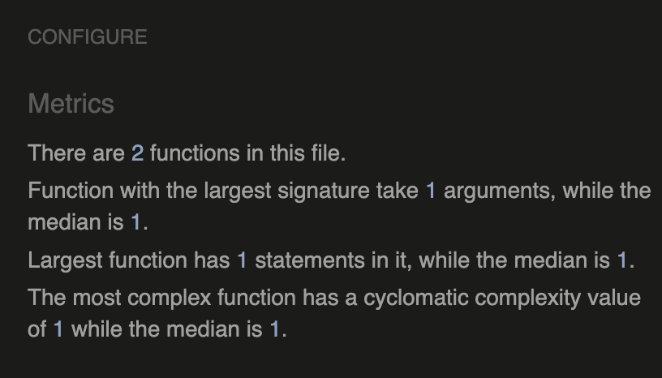
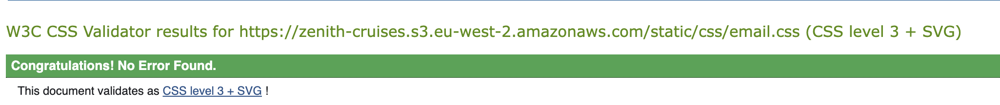

# Testing
 Click to return back to [README.md](README.md)

## Code Validation

### Javascript JSHint 
All JavaScript code was analysed with [JSHint](https://jshint.com)

** Some JS files may appear to contain undefined variables. This is because those are created by Django in different templates when views are rendered. ** 

| File | Screenshot |
|---|---|
|admin.js||
|book.js||
|edit.js||
|filter.js||
|new_cruise.js||
|new_destination.js||

### CSS Validation

**Important note about CSS in this project**

- For the Cruise Manager system CSS styling was achieved using the [Tailwind](https://tailwindcss.com/) framework and tooling. Therefore the files **input.css** and **style.css** has been automatically been generated by Tailwind so I have not run them through the validator.
- For the customer (non-staff) facing sections of this project I have used custom vanilla CSS. I have validated all of those files and recorded the results below.

CSS files were validated with the [W3C CSS Validation Service](https://jigsaw.w3.org/)

| File | Screenshot |
|---|---|
| [email.css](https://jigsaw.w3.org/css-validator/validator?uri=https%3A%2F%2Fzenith-cruises.s3.eu-west-2.amazonaws.com%2Fstatic%2Fcss%2Femail.css&profile=css3svg&usermedium=all&warning=1&vextwarning=&lang=en) |  |
| [main.css](https://jigsaw.w3.org/css-validator/validator?uri=https%3A%2F%2Fzenith-cruises.s3.eu-west-2.amazonaws.com%2Fstatic%2Fcss%2Fmain.css&profile=css3svg&usermedium=all&warning=1&vextwarning=&lang=en) |  |

### PEP8 Python Validation

Validation was achieved using CodeInstitute's PEP8 validation tool

## Booking app

|File|Screenshot|
|---|---|
|[forms.py](https://pep8ci.herokuapp.com/https://raw.githubusercontent.com/ancfoster/Zenith-Expedition-Cruises/main/booking/forms.py)||
|[urls.py](https://pep8ci.herokuapp.com/https://raw.githubusercontent.com/ancfoster/Zenith-Expedition-Cruises/main/booking/urls.py)||
|[views.py](https://pep8ci.herokuapp.com/https://raw.githubusercontent.com/ancfoster/Zenith-Expedition-Cruises/main/booking/views.py)||

## Cruise Manager App

|File|Screenshot|
|---|---|
|[forms.py](https://pep8ci.herokuapp.com/https://raw.githubusercontent.com/ancfoster/Zenith-Expedition-Cruises/main/cruise_manager/forms.py)||
|[urls.py](https://pep8ci.herokuapp.com/https://raw.githubusercontent.com/ancfoster/Zenith-Expedition-Cruises/main/cruise_manager/urls.py)||
|[views.py](https://pep8ci.herokuapp.com/https://raw.githubusercontent.com/ancfoster/Zenith-Expedition-Cruises/main/cruise_manager/views.py)||

## Cruises App

|File|Screenshot|
|---|---|
|[forms.py](https://pep8ci.herokuapp.com/https://raw.githubusercontent.com/ancfoster/Zenith-Expedition-Cruises/main/cruises/admin.py)||
|[models.py](https://pep8ci.herokuapp.com/https://raw.githubusercontent.com/ancfoster/Zenith-Expedition-Cruises/main/cruises/models.py)||
|[urls.py](https://pep8ci.herokuapp.com/https://raw.githubusercontent.com/ancfoster/Zenith-Expedition-Cruises/main/cruises/urls.py)||
|[views.py](https://pep8ci.herokuapp.com/https://raw.githubusercontent.com/ancfoster/Zenith-Expedition-Cruises/main/cruises/views.py)||

## Site Pages App

|File|Screenshot|
|---|---|
|[forms.py](https://pep8ci.herokuapp.com/https://raw.githubusercontent.com/ancfoster/Zenith-Expedition-Cruises/main/site_pages/admin.py)||
|[models.py](https://pep8ci.herokuapp.com/https://raw.githubusercontent.com/ancfoster/Zenith-Expedition-Cruises/main/site_pages/models.py)||
|[forms.py](https://pep8ci.herokuapp.com/https://raw.githubusercontent.com/ancfoster/Zenith-Expedition-Cruises/main/site_pages/forms.py)||
|[urls.py](https://pep8ci.herokuapp.com/https://raw.githubusercontent.com/ancfoster/Zenith-Expedition-Cruises/main/site_pages/urls.py)||
|[views.py](https://pep8ci.herokuapp.com/https://raw.githubusercontent.com/ancfoster/Zenith-Expedition-Cruises/main/site_pages/views.py)||

## Responsiveness

- Each page was tested using Google Chrome's developer tools where it is possible to mimick the screen size and other settings for different mobile and desktop devices. 
- Each page was tested with the Google Chrome settings for iPhone XR, iPad Air tablet and a MDI display laptop with a 1080p resolution.

## Manual Testing

Tests were carried to test all aspects of cruise manager admin and customer functionality.

- Example with experience page:

| Device | Screenshot |
|---|---|
|iPhone XR||
|iPhad Air||
|Laptop||

#### Bugs

Any bugs were documented on [GitHub](https://github.com/ancfoster/Zenith-Expedition-Cruises/issues?q=is%3Aissue+is%3Aclosed) as issues and then closed when fixed.

### Cruise Manager Admin

| Test | Expected Result | Pass or Fail? |
|---|---|---|
|Login to dashboard|Can only see dashboard when signed in as admin or staff user|Pass|
|Dashboard quick links | When clicked the dashboard links go to correct URLS|Pass|
|Navigation menu |Burger menu opens and closes with all links working |Pass|
|Create destination |Destination is created |Pass|
|Django messages | WHen an action is carried out in cruise manager a Django success/fail message will be shown on next screen |Pass|
|Delete destination | A destination being used by a movement/cruise will result in a message saying it cannot be deleted. An unassociated one can be deleted |Pass|
|Edit destination | A destination can be edited |Pass|
|Create tag | When tag form is submitted the inputted tag is created |Pass|
|Edit tag | When tag edit form is submitted the selected tag is updated |Pass|
|Delete tag | When tag is deleted, a confirmation message is displayed, then when confirmed the tag is deleted |Pass|
|Create cruise | After the new cruise has been filled out the cruise, movements and tickets will be generated |Pass|
|Edit cruise | When a cruise is edited the cruise is updated as per the new form inputs |Pass|
|Delete cruise| After confirming intention the cruise and its tickets and movements are deleted |Pass|
|Change enquiry status| A django message will appear on the screen confirming the status of an enquiry has been toggled |Pass|
|Delete enquiry| After confirming intention the enquiry is deleted from the database|Pass|